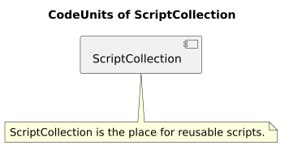
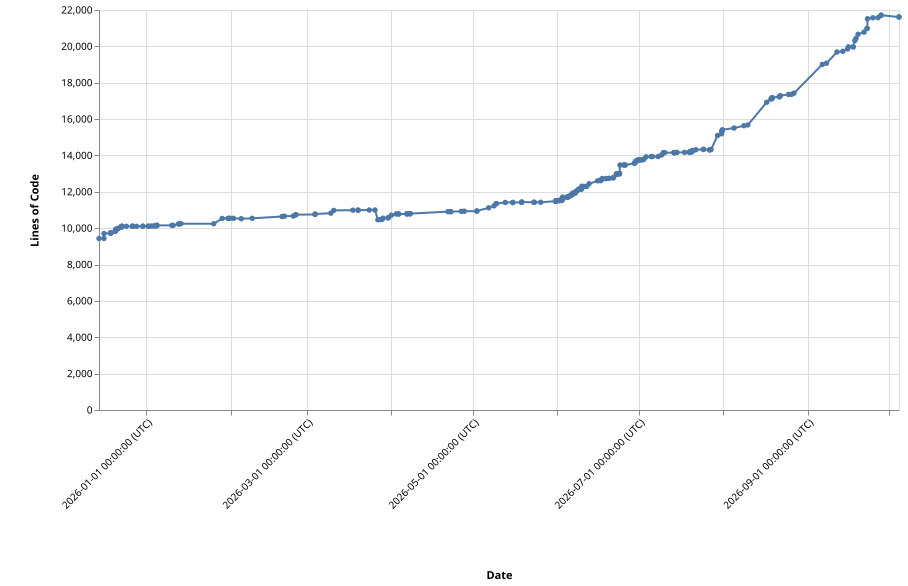

# ScriptCollection-reference

## Code-units-overview

## Lines-of-code

## Findings

This table collects all findings of code-reviews, security-checks, bug-searches, performance-analyses and similar checks of this repository, as defined by the specification `openspec/specs/findings/spec.md`.

| Id    | State | Description                                                                                                                                                                                                                                                                                                                                 | Impact                                                                                                                                                                                                                                                                              | Notes                                                                                                                                                                                                                                                                                                                                                                                                                                                                                                                                                                                                                                                                                                                                                                               |
| ----- | ----- | ------------------------------------------------------------------------------------------------------------------------------------------------------------------------------------------------------------------------------------------------------------------------------------------------------------------------------------------- | ----------------------------------------------------------------------------------------------------------------------------------------------------------------------------------------------------------------------------------------------------------------------------------- | ----------------------------------------------------------------------------------------------------------------------------------------------------------------------------------------------------------------------------------------------------------------------------------------------------------------------------------------------------------------------------------------------------------------------------------------------------------------------------------------------------------------------------------------------------------------------------------------------------------------------------------------------------------------------------------------------------------------------------------------------------------------------------------- |
| KI-01 | Open  | A containerized build (`scbuildcodeunits -c`/`scbuildcodeunitsc`) can not build a codeunit whose own scripts start a container themselves. The scripts of a codeunit are executed inside the build-container, and a container started from there would have to be a sibling of the build-container instead of a container inside it.        | Affected repositories can not use the containerized build and have to be built with the non-containerized `scbuildcodeunits`, so they lose the standardized build-environment.                                                                                                      | Category: build-environment. Found in the repository AthenaTournamentManager (ATM), whose visual-regression-tests (`Other/QualityCheck/VisualRegressionContainer.py`) and whose linux-build start an SCBuilder-container. Not analyzed yet whether the fix belongs into ScriptCollection (making the container-execution able to start siblings) or into the affected codeunit (detecting that it already runs inside the build-container and doing its work directly). State-check: the build-container gets the docker-socket forwarded (`TFCPS_CodeUnit_BuildCodeUnits.py`) and `ScriptCollectionCore.get_own_container_id` exists for `--volumes-from`, but nothing in ScriptCollection resolves the case of a codeunit-script which starts its own container with bind-mounts. |
| KI-02 | Open  | The bill-of-materials of a node-codeunit is not written when one of its packages has an unsatisfied optional peer-dependency. `cyclonedx-npm` runs `npm ls --json --long --all`, npm reports an optional peer-dependency which is present in another version as `invalid` and exits non-zero, and `cyclonedx-npm` aborts on that exit-code. | The codeunit gets no BOM-artifact at all while the build still reports success, so the dependency- and vulnerability-overview of that codeunit is missing without anybody noticing.                                                                                                 | Category: build/BOM. Found in the repository AthenaTournamentManager (ATM), codeunit `AthenaWebsite`: `jsdom` (through vitest) brings `@exodus/bytes` with the optional peer `@noble/hashes` in `^1.8.0 \|\| ^2.0.0`, while `pkijs` (through `@angular-devkit/build-angular`) pins it to `1.4.0`. Fix belongs where the tool is called: `cyclonedx-npm` has `--ignore-npm-errors` for this case. The `npm install --force` of the node-codeunit-automation hides such a conflict. State-check: `TFCPS_CodeUnitSpecific_NodeJS.py` and `TFCPS_CodeUnitSpecific_TypeScript.py` still call `cyclonedx-npm` without `--ignore-npm-errors`.                                                                                                                                              |
| KI-03 | Open  | `GeneralUtilities.get_version_parts` accepts versions with arbitrary separators, because the dots in its regex `^(\d+).(\d+).(\d+)$` are not escaped.                                                                                                                                                                                       | Invalid version-strings like `1x2x3` are accepted as `1.2.3` instead of being rejected.                                                                                                                                                                                             | Category: bug. Fix: escape the dots (`\.`). State-check: regex in `GeneralUtilities.py` is unchanged.                                                                                                                                                                                                                                                                                                                                                                                                                                                                                                                                                                                                                                                                               |
| KI-04 | Open  | `GeneralUtilities.is_ignored_by_glob_pattern` does not reliably reject paths outside the source-directory, because the check is a plain `startswith`.                                                                                                                                                                                       | A sibling-folder with a shared prefix (for example `/folder/src2/a.txt` for the source-directory `/folder/src`) passes the check; its relative path starts with `..` and can still be matched by patterns like `*`, so files outside the source-directory can be treated as inside. | Category: bug/security. Fix: compare against the source-directory plus a trailing path-separator, as `ScriptCollectionCore.path_is_allowed_within_base_folder` already does. State-check: still `path.startswith(source_directory)`.                                                                                                                                                                                                                                                                                                                                                                                                                                                                                                                                                |
| KI-05 | Open  | `GeneralUtilities.replace_underscores_in_text` never terminates for self-referencing replacements.                                                                                                                                                                                                                                          | If a value contains its own placeholder (for example `{"a": "__a__"}`) or two values reference each other, the replacement-loop runs forever and the calling process hangs.                                                                                                         | Category: bug. State-check: the `while changed`-loop without cycle-detection is unchanged.                                                                                                                                                                                                                                                                                                                                                                                                                                                                                                                                                                                                                                                                                          |
| KI-06 | Open  | `GeneralUtilities.timedelta_to_simple_string` is wrong for durations of 24 hours or more, because it formats a datetime with `%H`.                                                                                                                                                                                                          | The days are dropped, so for example 25 hours are shown as `01:00:00`.                                                                                                                                                                                                              | Category: bug. State-check: implementation still uses `strftime('%H:%M:%S')`.                                                                                                                                                                                                                                                                                                                                                                                                                                                                                                                                                                                                                                                                                                       |
| KI-07 | Open  | The error-messages of `translate_safe` name a wrong path: they say the translation-service has to be configured in `~/.ScriptCollection/TranslationServiceProperties.txt`, while the file is read from `~/.ScriptCollection/GlobalCache/TranslationServiceProperties.txt`.                                                                  | Users who follow the error-message create the file at the wrong place and the translation stays unconfigured.                                                                                                                                                                       | Category: bug (error-message). Affects the NodeJS- and Flutter-codeunit-specific classes. State-check: wrong path still in `TFCPS_CodeUnitSpecific_NodeJS.py` and `TFCPS_CodeUnitSpecific_Flutter.py`.                                                                                                                                                                                                                                                                                                                                                                                                                                                                                                                                                                              |
| KI-08 | Open  | `scprintfilecontent` checks a different file than it reads when `-b` is not the current working-directory: a relative `-p` is resolved against `-b` for the permission-check, but the file is then read relative to the current working-directory.                                                                                          | With a base-folder other than `.` a file outside the base-folder or inside an excluded folder can be read, which bypasses the restriction (relevant for example for restricted AI-command-execution).                                                                               | Category: security. With `-b .` (the default) both paths are the same. Fix: read the same resolved path which was checked. State-check: `Executables.PrintFileContent` still passes the unresolved `file` to `get_file_content`.                                                                                                                                                                                                                                                                                                                                                                                                                                                                                                                                                    |
| KI-09 | Open  | The testcase `get_latest_version` in `test_GeneralUtilities.py` never runs because its name has no `test_`-prefix, and its expectation is wrong (it expects `3.1.0` as latest version of `["2.3.4","3.1.0","16.5"]`, although `16.5` is not a valid version for `get_latest_version`).                                                      | Dead and misleading test-code; no effect on the product itself.                                                                                                                                                                                                                     | Category: test-quality. The intended behavior is covered by the `test_get_latest_version_*`-testcases, so the testcase can be removed. State-check: the method is still present.                                                                                                                                                                                                                                                                                                                                                                                                                                                                                                                                                                                                    |
